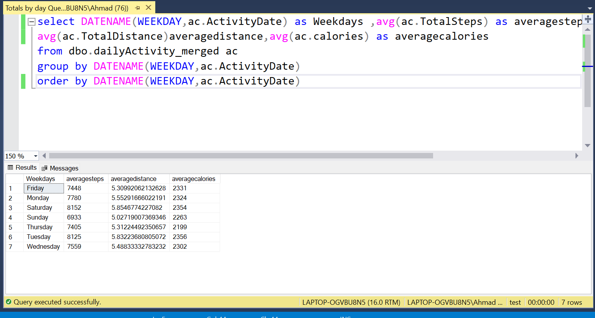

```{r setup, include=FALSE}
knitr::opts_chunk$set(echo = TRUE)
```

# Background

Urška Sršen and Sando Mur founded Bellabeat, a high-tech company that manufactures health-focused smart products.
Sršen used her background as an artist to develop beautifully designed technology that informs and inspires women
around the world. Collecting data on activity, sleep, stress, and reproductive health has allowed Bellabeat to empower
women with knowledge about their own health and habits. Since it was founded in 2013, Bellabeat has grown rapidly and
quickly positioned itself as a tech-driven wellness company for women.

By 2016, Bellabeat had opened offices around the world and launched multiple products. Bellabeat products became
available through a growing number of online retailers in addition to their own e-commerce channel on their website.

Sršen knows that an analysis of Bellabeat’s available consumer data would reveal more opportunities for growth. She
has asked the marketing analytics team to focus on a Bellabeat product and analyze smart device usage data in order to
gain insight into how people are already using their smart devices. Then, using this information, she would like high-level
recommendations for how these trends can inform Bellabeat marketing strategy.

# Aim
My primary aim in this case study was to identify customer trends while using non-bellabeat products, this would allow me to provide tailored information for Sršen which would then be translated into meaningful,data-driven business decisions.

The main aspects that would be taken into consideration are marketing strategy and product development recommendations based on the customer trends.


# Data Cleaning
I was provided with a public fitbit tracker dataset which included  personal fitness data from thirty fitbit users. I then viewed the dataset in excel to quickly skim the data keeping an eye out for any anomalies or errors in data entry and i found none of the sort.

Dataset: (https://www.kaggle.com/datasets/arashnic/fitbit)


# Processing
The dataset that I was provided with had everything I needed however I wanted to calculate averages and group them by weekday in order to compare activity rates and calories burnt in different days and especially see the difference between weekends and working days.
I used SQL Server to gather the processed data that i needed using this query

```{r echo=FALSE}

```

# Analysis 
In this Phase I then transitioned to R studio in order to analyze the dataset and create some visualizations.
The main aspects that I focused on were the weekday analysis using averages, and correlations between activity rates and calories burnt throughout the day.
This would give Bellabeat some insights on the average activity rates and customer trends and they could translate this into business decisions in regards to their products' development and marketing strategy.

```{r echo=FALSE,fig.width=10,fig.height=4.5}
library(readr)
avgbyday<-read.csv("averages by weekday.csv")
#ordering days  
avgbyday$Weekday <- ordered(avgbyday$Weekday, levels=c("Sunday","Monday","Tuesday","Wednesday","Thursday","Friday", "Saturday"))

library(ggplot2)
ggplot(data = avgbyday)+
  geom_col(mapping = aes(x=Weekday,y=Avg_Steps,fill=Weekday))+
  labs(title = "Average Steps Per Weekday",y="Average Steps",
       caption = "Data Collected In 2016")

```
Key insights:

-Highest average steps were on weekends in general and on saturday specifically with 8152 steps


```{r echo=FALSE,fig.width=10,fig.height=4.2}
ggplot(data = avgbyday)+
  geom_col(mapping = aes(x=Weekday,y=Avg_calories,fill=Weekday))+
  labs(title = "Average Calories Burnt Per Weekday",y="Average Calories",
       caption = "Data Collected In 2016")
```
Key insights:

-Highest average calories burnt was greater in weekends in general compared to weekdays and highest average calories burnt were on saturday with 2354 calories


```{r echo=FALSE,message=FALSE,fig.width=10,fig.height=4.2}

library(readr)
fitbit_data<-read_csv("dailyActivity_merged.csv")
ggplot(data=fitbit_data)+
  geom_smooth(mapping = aes(x=TotalSteps,y=Calories))+
  labs(title= "Correlation Between Steps and Calories",
       caption = "Data Collected In 2016")

```
Key insights:

-The higher the total steps taken the more calories were burnt


## Correlations between activity rates and calories burnt 
activity was seperated into 4 columns in this dataset 
Very Active Minutes,
Fairly Active Minutes,
Slightly Active Minutes, and  
Sedentary Minutes. My focus was to see what difference does a higher Very Active Minutes have on calories burnt as well as sedentary minutes

```{r echo=FALSE,message=FALSE,fig.width=10,fig.height=5.8}
library(dplyr)
fitbit_data %>% 
  ggplot(aes(x=VeryActiveMinutes,y= Calories))+
  geom_point()+
  geom_smooth()+
  labs(title ="Correlation Between Very Active Minutes and Calories Burnt" ,
       caption = "Data Collected In 2016")

```
Key Insights:

-When there was more "Very Active Minutes" more calories were burnt (Positive Correlation)


```{r echo=FALSE,message=FALSE,fig.width=10,fig.height=5.8}
  fitbit_data %>% 
  ggplot(aes(x=SedentaryMinutes,y= Calories))+
  geom_point()+
  geom_smooth()+
    labs(title ="Correlation Sedentary Minutes and Calories Burnt" ,
         caption = "Data Collected In 2016")

```
key Insights:

-When there was more "Sedentary Minutes" less calories were burnt (Negative Correlation)

# Key Insights 

The key insights that i have gained from my analysis were: 

1-The 30 Users of the fitbit watch were more active during weekends rather than weekdays and burnt more calories on weekends as well

2-There is a Positive correlation between total steps taken and calories burnt

3-there is a Positive correlation between very active minutes while there was a negative correlation between sedentary minutes and calories burnt

## Recommendations
My recommendations to bellabeat and Urška Sršen would be to:

1- Focus on marketing for their products on weekends as fitness users are generally more active on weekends which would make them have an incentive to purchase the fitness products

2-In their product development they should focus on notifying the users when their daily steps are low and that they should increase their steps as steps are the main factor for burning calories

3- For product development they should focus on creating fitness plans that weigh more of the weekly fitness routine on weekends as they are the time where people were most active in

4- Bellabeat products should measure their users' activity rates in a similar format to the fitbit app and notify users when activity rates are not high, as they are essential to burning calories